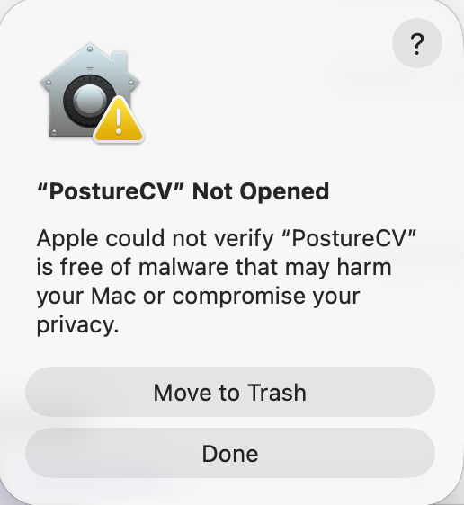

# PostureCV
A free, open-source tool to fix your posture for macOS. 

By Richard Li - https://github.com/richardli52

> [!WARNING]
> You must read the [Installation](#installation) section before attempting to use PostureCV. Directly downloading from Releases will not work immediately. 

## What it is
PostureCV is a minimalist menu bar app that passively monitors your sitting posture using computer vision. 

<div align="center">
   <br>
      <em>PostureCV as the praying emoji in the Mac menu bar</em> 
</div>
<br>

Most posture correction software relies on continuous video feeds which can drain laptop batteries and consume significant CPU resources. Web app alternatives can lead to privacy concerns. PostureCV operates locally and only captures one frame per some custom interval, such as every 60 seconds. 

## The Mechanics
Some posture software tracks the absolute pixel position of the face. This breaks down because it leads to false positives when you even slightly adjust your laptop screen or move your position. Another approach, taken by [Posture Pal](https://apps.apple.com/us/app/posture-pal-improve-alert/id1590316152), is tracking where the head is facing based on AirPods.

PostureCV uses angles instead of absolute pixel coordinates to determine slouching. It calculates the vector angle between your ear and your shoulder relative to a vertical axis. This makes the detection resilient to minor movements. For instance, you can sit closer or further back from your webcam, and the angle of your ear to your shoulder relative to a vertical axis remains consistent. 

This successfully detects slouching because when you lean forward toward the webcam, the minimum vertical distance between the ear and the shoulder collapses while the minimum horizontal distance is fixed, which increases our angle of interest. When PostureCV detects that this angle is higher than the threshold, an alert is given. 

Necessary conditions are outlined in the [Optimal Setup](#optimal-setup) section. 

<div align="center">
   <br>
      <em>Demo of mechanics in the Debug View window</em>
    <br>
        <br>

</div>

Learn more about Debug View in the [Manual Calibration](#manual-calibration) section below. 

PostureCV calculates the angle $\theta$ using the arctangent function:

$$
\theta = \arctan\left(\frac{|x_{ear} - x_{shoulder}|}{|y_{ear} - y_{shoulder}|}\right) \times \frac{180}{\pi}
$$

As stated above, if PostureCV detects that $\theta$ exceeds your threshold, the app triggers an alert. See the [Notifications and Alerts](#notifications-and-alerts) section below for alert options. 

The main limitations to this approach are false positives when the head leans to the side or when you temporarily look downward (e.g., to grab something from your bag). Sensitivity-related errors can be minimized via automatic and manual calibration, as seen in the [Manual Calibration](#manual-calibration) section below. 

Credit for these mechanics (and other aspects of the setup, including choice of some libraries) goes to [Tiff In Tech](https://github.com/TiffinTech/posture-corrector). 

### Optimal Setup
For best results:
* **Keep the camera at eye level or above.** Low angles (looking up at your chin) make it hard to accurately detect the neck angle.
* **Use a stable surface.** Avoid using the laptop on your lap because the moving camera angle will cause inconsistent readings.

## Installation

There are two ways to install PostureCV. I strongly recommend **Option A (Homebrew)**.

### Option A: Homebrew (Recommended)
This is the easiest method. If you already have Homebrew installed, skip to Step 2.

**1. Install Homebrew (If you don't have it)**. If you've never used Homebrew, it is a standard tool for installing open source software on Mac.
1. Open your Terminal app.
2. Paste this command and hit Enter (follow the prompts on screen):
   ```bash
   /bin/bash -c "$(curl -fsSL https://raw.githubusercontent.com/Homebrew/install/HEAD/install.sh)"
   ```
   *(For more details, visit the official site: [brew.sh](https://brew.sh))*

**2. Install PostureCV**. Once Homebrew is ready, paste and enter these two commands in your Terminal:

```bash
brew tap richardli52/posturecv
brew install --cask posturecv
```
Terminal may prompt you to enter your Mac password. 


This will automatically download the app, move it to your Applications folder, and fix the "unidentified developer" permissions for you. Skip to the [Usage](#usage) section once this is complete. 

---

### Option B: Manual Download
If you prefer not to use Homebrew, you can also download the app directly, with a caveat.

1. **Download:** Go to the [PostureCV releases page](https://github.com/richardli52/postureCV/releases) and download the latest `.zip` file.
2. **Install:** Unzip the file and drag `PostureCV.app` into your Applications folder.
3. **Fix Permissions:**
   Because this is an open-source app not signed with a paid Apple Developer ID, macOS may show an error saying the app is "Damaged" and should be moved to trash when you first click it.

  <table align="center">
  <tr>
    <td align="center">
      
      <br>
      <em>If you see this error, follow the step below.</em>
    </td>
    <td align="center">
      
      <br>
      <em>If you see this error, follow the step below.</em>
    </td>
  </tr>
  </table>


   To fix this, open your Terminal and paste this single command, then enter, to whitelist the app (ensure you've moved PostureCV.app into Applications before proceeding):
   ```bash
   xattr -cr /Applications/PostureCV.app
   ```
   You can now open the app normally. Note that PostureCV only appears as a praying emoji (🧘) in your macOS menu bar, and not in the dock. 

---

## Usage
> [!WARNING]
> **iPhone Users: Disable Continuity Camera**. 
> If you have an iPhone on the same Apple ID, this app will default to using your iPhone camera instead of your webcam.
>
> **To fix this:**
> On your iPhone, go to **Settings > General > AirPlay & Handoff**, scroll to the bottom, and toggle **Continuity Camera** **OFF**.
>
1. Open **PostureCV** from your Applications folder.
2. Look for the praying emoji (🧘) in your macOS menu bar. You may have to wait 10-20 seconds on the first time. 
<div align="middle">
   <br>
      <em>Menu Bar Icon</em>
</div>
<br>

3. Sit in your ideal posture and click **Calibrate** in the menu dropdown to automatically set your baseline posture angle. Most users should see the [Manual Calibration](#manual-calibration) section for more accurate customization. 
<div align="middle">
   <br><em>Calibration Confirmation</em><br>
</div>
<br>

4. Grant camera permissions when macOS prompts you.

5. Use the **Preferences** menu to adjust how often the app checks your posture and how sensitive the angle detection should be. You can also toggle sound and notifications here.
<table align="center">
  <tr>
    <td align="center">
      
      <br>
      <em>Preferences</em>
    </td>
    <td align="center">
      
      <br>
      <em>Interval</em>
    </td>
    <td align="center">
      
      <br>
      <em>Threshold</em>
    </td>
  </tr>
</table>

> [!TIP]
> **Adjusting Sensitivity.**
> The default threshold is conservative. Most users will need to lower the threshold value to increase sensitivity. Use the Debug View (see below) to find the right threshold for your setup. 

6. Click **Start Monitoring** in the menu dropdown to begin checking for slouching. 
<table align="center">
  <tr>
    <td align="center">
      
      <br>
      <em>Good Posture</em>
    </td>
    <td align="center">
      
      <br>
      <em>Slouching</em>
    </td>
  </tr>
</table>


## Manual Calibration
Clicking Open Debug View in the menu opens a live camera feed with your ear and shoulder joint locations detected by computer vision. This allows you to visualize what angle constitutes slouching.

**To find and use your optimal angle threshold:**
1. Open Debug View while sitting upright and note the angle displayed
2. Slouch forward and observe the new angle
3. Set your threshold somewhere between these two values by clicking Preferences > Change Threshold (Manual) in the menu dropdown
4. Press `q` to close Debug View
<br>
<div align="center">
   <br>
      <em>Debug View window while slouching</em>
</div>

## Auto Pause
To prevent confusion, the app automatically pauses monitoring when it detects that specific video conferencing apps are running. These apps include:
* zoom.us
* FaceTime
* Photo Booth
* Microsoft Teams
* Webex
* Skype

It automatically resumes when the video conferencing app closes. If you use Google Meet or Zoom inside a web browser, however, PostureCV cannot detect this. You must pause monitoring manually using the menu bar if you'd like.

Auto Pause can be turned on or off in Preferences. 

## Notifications and Alerts
You can customize how the application alerts you of slouching. Options include: 
* **Sound**: system alert sound
* **Flash Menu Bar**: the menu bar alternates with a warning sign emoji
* **Notification**: sends a native macOS notification banner
<table align="center">
  <tr>
    <td align="center">
      
      <br>
      <em>Flash Menu Bar</em>
    </td>
    <td align="center">
      
      <br>
      <em>Notification</em>
    </td>
  </tr>
</table>


Note that native notifications will not appear if you have any Focus Mode (such as Do Not Disturb or Personal) active.

## Privacy and Memory
The application is designed privacy-first. It processes all camera data in RAM and discards the data immediately after the angle calculation is complete. The software never saves video or image files and never transmits data to any external server. It stands out from other offerings, including paid apps, for this reason. 

## Compatibility
PostureCV is built specifically for Apple Silicon Macs (M1, M2, M3, and newer). It does not currently support Intel-based Macs. 

## Run from Source
If you prefer to run PostureCV from the Python script directly or modify the code:
1. Clone this repository
2. Install dependencies: `pip install -r requirements.txt`
3. Run the app: `python3 posture_app.py`

## Debugging

### App cannot be opened. 

<table align="center">
  <tr>
    <td align="center">
      
      <br>
      <em>If you see this error, follow the step below.</em>
    </td>
    <td align="center">
      
      <br>
      <em>If you see this error, follow the step below.</em>
    </td>
  </tr>
  </table>

You might not have installed the application properly. See the [Installation](#installation) section to resolve this. 

### Camera not detected or opening on iPhone instead of webcam. 
Read the start of the [Usage](#usage) section for a solution. 

### No response when opening app. 

The application takes 10-20 seconds to open for the first time. 

### The app is not detecting my slouching. 

Read the [Manual Calibration](#manual-calibration) section for more effective customization. 

## Acknowledgements
Mechanics and choice of some libraries adapted from [Tiff In Tech](https://github.com/TiffinTech/posture-corrector). 

## Logo

<div align="left">
   <br>
      <em>PostureCV Logo</em>
</div>