# PostureCV
A free, open-source tool to fix your posture for macOS. 

By Richard Li - https://github.com/richardli52

## What it is
PostureCV is a minimalist menu bar app that passively monitors your sitting posture using computer vision. 

<div align="center">
   <br>
      <em>Menu Bar</em> 
</div>
<br>

Most posture correction software relies on continuous video feeds which can drain laptop batteries and consume significant CPU resources. Existing web apps can lead to privacy concerns. PostureCV operates differently by capturing one single frame at a specific custom interval, such as every 60 seconds. 

### The Mechanics
Some posture software tracks the absolute pixel position of the face. This breaks down because it leads to false positives when you adjust your laptop screen or move your chair. One other approach, taken by [Posture Pal](https://apps.apple.com/us/app/posture-pal-improve-alert/id1590316152), is tracking where the head is facing based on AirPods.

PostureCV uses angles instead of absolute pixel coordinates to determine slouching. It calculates the vector angle between your ear and your shoulder relative to a vertical axis. This makes the detection resilient to camera movement. You can adjust your webcam height or sit further back, and the angle of your neck remains consistent.

<div align="center">
  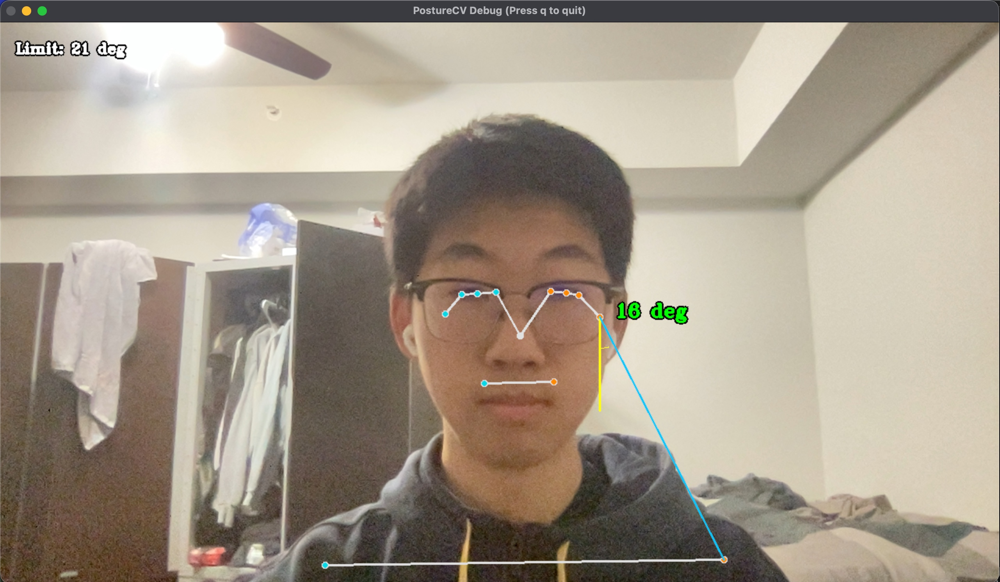 <br>
      <em>Demo of Mechanics</em>
</div>
<br>
Learn more about Debug View in the Debugging and Calibration section below. 
<br>
<br>

PostureCV calculates the angle $\theta$, shown below, using the arctangent function
$$\theta = \arctan\left(\frac{|x_{ear} - x_{shoulder}|}{|y_{ear} - y_{shoulder}|}\right) \times \frac{180}{\pi}$$

If the calculated angle exceeds your threshold, the system triggers an alert. See the Notifications and Alerts section below for the choice of how you would like to be alerted. 

The main limitations to this approach are false positives when the head leans to the side or when you temporarily look downward (e.g., to grab something from your bag). Sensitivity-related errors can be minimized via automatic and manual calibration, as seen in the Debugging and Calibration section below.

Credit for these mechanics (and other aspects of the setup, including choice of libraries) goes to [Tiff In Tech](https://github.com/TiffinTech/posture-corrector). 

## Installation

There are two ways to install PostureCV. I strongly recommend **Option A (Homebrew)**.

### Option A: Homebrew (Recommended)
This is the easiest method. If you already have Homebrew installed, skip to Step 2.

**1. Install Homebrew (If you don't have it)**. If you've never used Homebrew, this is a standard tool for installing open source software on Mac.
1. Open your **Terminal** app (Command+Space, type "Terminal").
2. Paste this command and hit Enter (follow the prompts on screen):
   ```bash
   /bin/bash -c "$(curl -fsSL https://raw.githubusercontent.com/Homebrew/install/HEAD/install.sh)"
   ```
   *(For more details, visit the official site: [brew.sh](https://brew.sh))*

**2. Install PostureCV**. Once Homebrew is ready, paste and enter these two commands in your Terminal:

```bash
brew tap richardli52/posturecv
brew install --cask posturecv
```
Terminal may prompt you to enter your Mac password. 


This will automatically download the app, move it to your Applications folder, and fix the "unidentified developer" permissions for you. Skip to the Usage section once this is complete. 

---

### Option B: Manual Download
If you prefer not to use Homebrew, you can download the app directly.

1. **Download:** Go to the [PostureCV releases page](https://github.com/richardli52/postureCV/releases) and download the latest `.zip` file.
2. **Install:** Unzip the file and drag `PostureCV.app` into your Applications folder.
3. **Fix Permissions:**
   Because this is an open-source app not signed with a paid Apple Developer ID, macOS may show an error saying the app is "Damaged" and should be moved to trash when you first click it.

   <div align="middle">
      <br>
     <em>If you see this error, follow the step below.</em>
   </div>
   <br>

   To fix this, open your Terminal and paste this single command, then enter, to whitelist the app:
   ```bash
   xattr -cr /Applications/PostureCV.app
   ```
   You can now open the app normally!

---

## Usage
> [!WARNING]
> **iPhone Users: Disable Continuity Camera**
> If you have an iPhone signed into the same Apple ID, this app may default to using your iPhone camera instead of your webcam.
>
> **To fix this:**
> On your iPhone, go to **Settings > General > AirPlay & Handoff**, scroll to the bottom, and toggle **Continuity Camera** to **OFF**.
>
> *If you skip this step, the app may silently connect to your phone's camera in the background.*
1. Open **PostureCV** from your Applications folder.
2. Grant **Camera Permissions** when macOS prompts you.
3. Look for the praying emoji (🧘) in your macOS menu bar near the clock.
<div align="middle">
  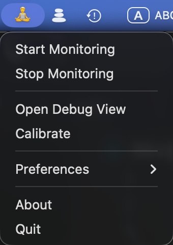 <br>
      <em>Menu Bar Icon</em>
</div>
<br>

4. Sit up straight in your ideal posture and click **Calibrate** in the menu dropdown to automatically set your baseline.
<div align="middle">
  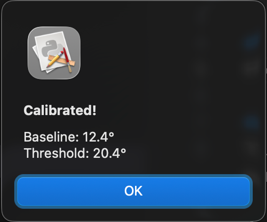 <br><em>Calibration Confirmation</em><br>
</div>
<br>

5. Use the **Preferences** menu to adjust how often the app checks your posture and how sensitive the angle detection should be. You can also toggle sound and notifications here.
<table align="center">
  <tr>
    <td align="center">
      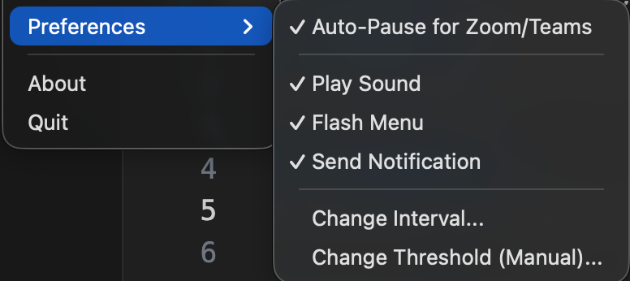
      <br>
      <em>Preferences</em>
    </td>
    <td align="center">
      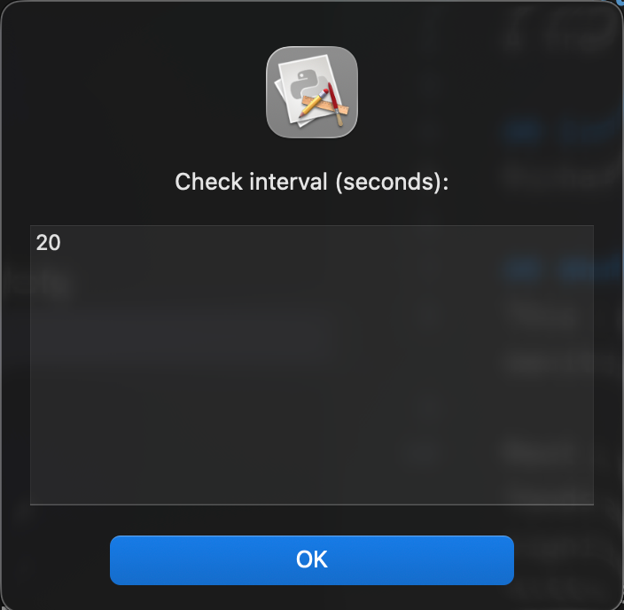
      <br>
      <em>Interval</em>
    </td>
    <td align="center">
      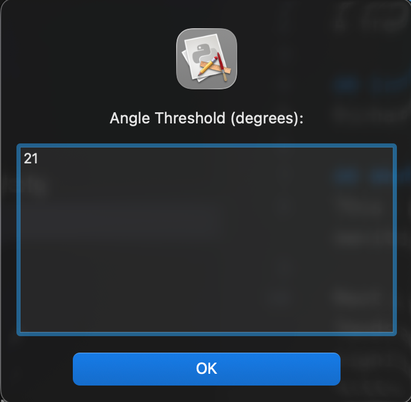
      <br>
      <em>Threshold</em>
    </td>
  </tr>
</table>

> [!TIP]
> **Adjusting Sensitivity**
> The default threshold is conservative. Most users will need to lower the threshold value to increase sensitivity. Use the Debug View (see below) to find the right threshold for your setup. Watch how the angle changes when you slouch versus when you sit with good posture, then adjust the threshold accordingly.

6. Click **Start Monitoring** to begin checking for slouching.
<table align="center">
  <tr>
    <td align="center">
      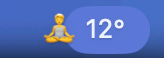
      <br>
      <em>Good Posture</em>
    </td>
    <td align="center">
      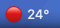
      <br>
      <em>Slouching</em>
    </td>
  </tr>
</table>


## Debugging and Calibration
If you are unsure why you are receiving alerts, you can click Open Debug View in the menu. This opens a temporary window showing your live camera feed with an overlay of ear and shoulder joint locations detected by computer vision. This allows you to visualize exactly what the computer sees and determine the best angle threshold that constitutes slouching.

**To find your optimal threshold:**
1. Open Debug View while sitting with good posture and note the angle displayed
2. Slouch forward and observe how much the angle increases
3. Set your threshold somewhere between these two values
4. Test by slouching and checking if alerts trigger appropriately
<br>
<br>
<div align="center">
  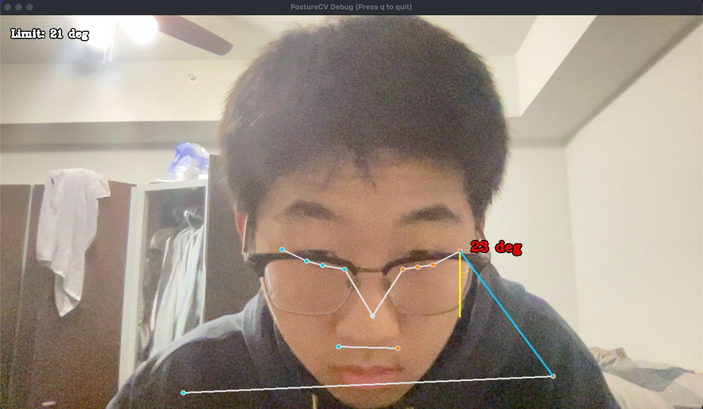 <br>
      <em>Debug View, Slouching</em>
</div>
<br>

## Auto Pause
To prevent camera conflicts, the application automatically pauses monitoring when it detects that specific video conferencing apps are running. This feature can be turned on or off in Preferences. 
* zoom.us
* FaceTime
* Photo Booth
* Microsoft Teams
* Webex
* Skype

If you use Google Meet or Zoom inside a web browser like Chrome or Safari, the app cannot detect this automatically. You must pause monitoring manually using the menu bar if you'd like.

## Notifications and Alerts
You can customize how the application alerts you when slouching is detected.
* Sound plays a system alert sound
* Flash Menu Bar changes the menu bar icon color to red
* Notification sends a native macOS notification banner
<table align="center">
  <tr>
    <td align="center">
      
      <br>
      <em>Slouching Alert Menu Bar Flashing</em>
    </td>
    <td align="center">
      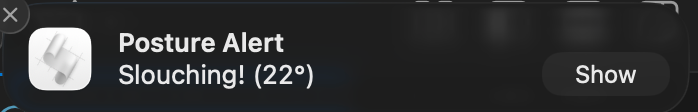
      <br>
      <em>Notification</em>
    </td>
  </tr>
</table>


Note that native notifications will not appear if you have any Focus Mode (such as Do Not Disturb or Personal) active.

## Privacy and Memory
The application is designed privacy-first. It processes all camera data in RAM and discards the data immediately after the angle calculation is complete. The software never saves video or image files and never transmits data to any external server or cloud service. It stands out from other offerings, including paid apps, for this reason. Privacy is why I built this project in the first place. 

## Compatibility
The vision model uses MediaPipe, which detects locations of facial features even if you are wearing glasses, headphones, or hats. The only features that matter here are the ears and shoulders. 

PostureCV is built specifically for **Apple Silicon Macs** (M1, M2, M3, and newer). It does not currently support older Intel-based Macs. 

## Run from Source
If you prefer to run the Python script directly or modify the code:
1. Clone this repository
2. Install dependencies: `pip install -r requirements.txt`
3. Run the app: `python3 posture_app.py`

## Credits
Mechanics and choice of libraries adapted from [Tiff In Tech](https://github.com/TiffinTech/posture-corrector). 

## Logo

<div align="left">
  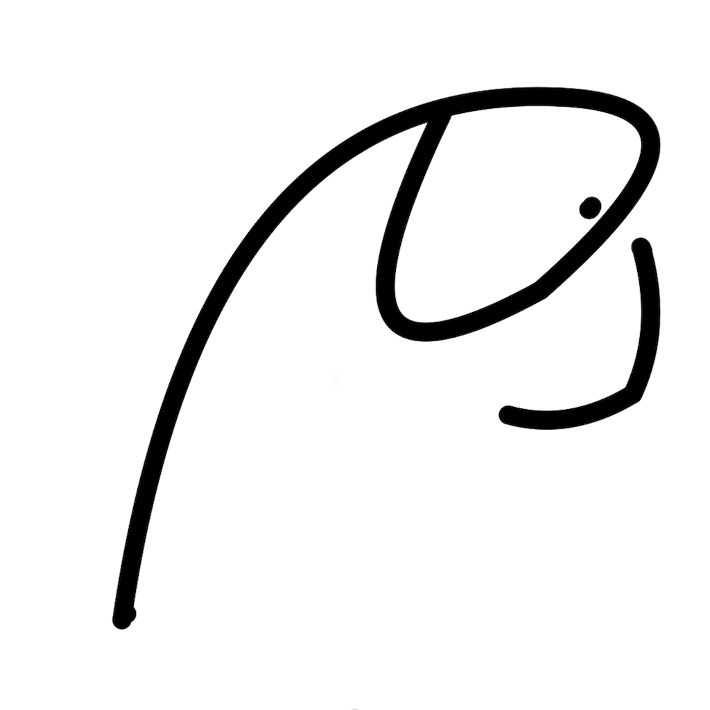 <br>
      <em>PostureCV Logo</em>
</div>